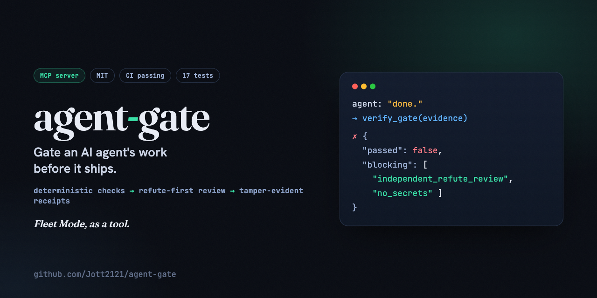
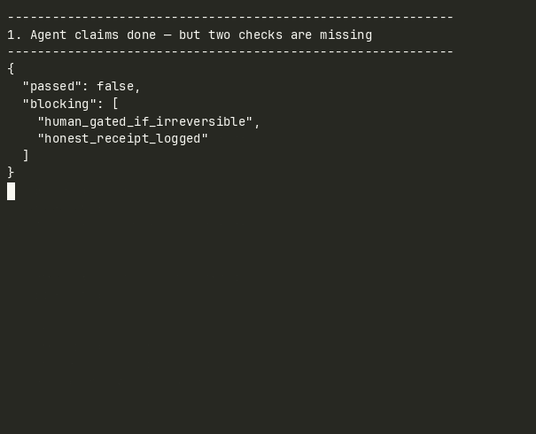

<!-- mcp-name: io.github.Jott2121/agent-gate -->


# agent-gate

[](https://github.com/Jott2121/agent-gate/actions/workflows/ci.yml)
[](LICENSE)
[](https://www.python.org/)
[](https://modelcontextprotocol.io/)

**An MCP server that lets an AI agent gate its own work before it claims "done": deterministic checks, then an independent refute-first review, then a tamper-evident honest receipt.**

Agents that grade their own homework ship low-quality output. `agent-gate` turns that discipline into tools an agent must actually pass: a **fail-closed** checklist and an **append-only, hash-chained** receipts ledger. It is [Fleet Mode](https://github.com/Jott2121/fleet-mode), my agent-orchestration doctrine, made into a runnable tool. Receipts over hype, enforced by the data structures.

> 🧩 One layer of a five-repo [**cost-governance stack**](https://github.com/Jott2121/bow#the-system-a-cost-governance-stack) for operating AI agents cost-efficiently; [bow](https://github.com/Jott2121/bow) is the flagship that runs every layer in production.

```text
agent: "done!"  ->  verify_gate(evidence)  ->  { passed: false, blocking: ["independent_refute_review", "no_secrets"] }
```



## Why

The expensive failures in agent systems are the silent ones: a model update degrades output, a change quietly breaks a workflow, an agent declares success while the work is wrong. The fix is not a smarter model. It is a gate the agent cannot talk its way past:

- **Fail-closed.** A check counts as satisfied only if it is *explicitly* true. Missing proof is not proof. (Mirrors a promotion gate, not an informal check.)
- **Tamper-evident receipts.** Every decision is recorded as `(decision, metric, value, verdict)` linked into a sha256 chain. Edit or delete any past receipt and `verify_chain()` returns false. The honest log is enforced by the structure, not by good intentions.
- **Human-gated by default.** "Any irreversible/outward act got human approval" is a required check. Agents draft, humans approve.

## Tools (over MCP)

| Tool | What it does |
|---|---|
| `gate_checklist(name="ship")` | Returns the checklist the agent must satisfy before claiming done. |
| `verify_gate(evidence, name="ship")` | Evaluates evidence **fail-closed** and returns `{passed, blocking}`. |
| `record_receipt(decision, metric, value, verdict)` | Appends an honest, hash-chained receipt; returns it. |
| `read_receipts()` | Returns every receipt plus whether the chain is intact. |

The default **`ship` gate** encodes Fleet Mode: `deterministic_checks_pass`, `independent_refute_review`, `no_secrets`, `human_gated_if_irreversible`, `honest_receipt_logged`.

## Install & wire into an MCP client

```bash
pip install mcp-agent-gate   # or: pip install -e . (from source)
```

Add it to your MCP client (Claude Desktop / Claude Code) config:

```json
{
  "mcpServers": {
    "agent-gate": { "command": "python", "args": ["-m", "agent_gate.server"] }
  }
}
```

Now your agent can call `verify_gate(...)` before it tells you it is finished, and you get a tamper-evident trail of what it decided. Receipts persist to `~/.agent-gate/receipts.jsonl` (override with `AGENT_GATE_LEDGER`).

## Use it directly (no MCP client needed)

```python
from agent_gate.gate import DEFAULT_SHIP_GATE
from agent_gate.ledger import Ledger

res = DEFAULT_SHIP_GATE.evaluate({
    "deterministic_checks_pass": True,
    "independent_refute_review": True,
    "no_secrets": True,
    "human_gated_if_irreversible": True,
    # honest_receipt_logged missing  ->  fail-closed
})
print(res.passed, res.blocking)   # False ['honest_receipt_logged']

led = Ledger("receipts.jsonl")
led.append(decision="ship v0.1", metric="tests", value="pass", verdict="shipped")
print(led.verify_chain())         # True  (until someone edits the log)
```

## Design

- **Tested, stdlib-only core.** `agent_gate/gate.py` (fail-closed checklist) and `agent_gate/ledger.py` (hash-chained receipts) are pure stdlib: fast to read, fast to trust. `agent_gate/server.py` is a thin MCP adapter over them (the one runtime dependency: `mcp`).
- **Tests pass on Python 3.11-3.13 (see CI).** The MCP tools are tested by *calling them*, not just importing.

## Tests

```bash
pip install -e ".[dev]" && python -m pytest -q
```

## Demo

Run it yourself: `PYTHONPATH=. python3 examples/demo.py`

```
------------------------------------------------------------
1. Agent claims done — but two checks are missing
------------------------------------------------------------
{
  "passed": false,
  "blocking": [
    "human_gated_if_irreversible",
    "honest_receipt_logged"
  ]
}

------------------------------------------------------------
2. Agent satisfies all five checks
------------------------------------------------------------
{
  "passed": true,
  "blocking": []
}

------------------------------------------------------------
3. Record a hash-chained receipt
------------------------------------------------------------
{
  "seq": 1,
  "decision": "ship v0.1",
  "verdict": "shipped",
  "hash": "015202a168512f15..."
}
{
  "seq": 2,
  "decision": "deploy",
  "verdict": "approved",
  "hash": "9533d304d4dd07e5..."
}

------------------------------------------------------------
4. Verify the chain — edit receipts.jsonl to see this flip to False
------------------------------------------------------------
chain_intact: True
```

## Contributing

See [CONTRIBUTING.md](CONTRIBUTING.md).

## About

Built by **Jeff Otterson** ([Jott2121](https://github.com/Jott2121)). `agent-gate` operationalizes the gating discipline from [**bow**](https://github.com/Jott2121/bow) (an autonomous all-Claude chief-of-staff agent) and the [**Fleet Mode**](https://github.com/Jott2121/fleet-mode) doctrine. Siblings in the same line: [**rag-guard**](https://github.com/Jott2121/rag-guard) and [**agent-cost-attribution**](https://github.com/Jott2121/agent-cost-attribution). MIT licensed.
